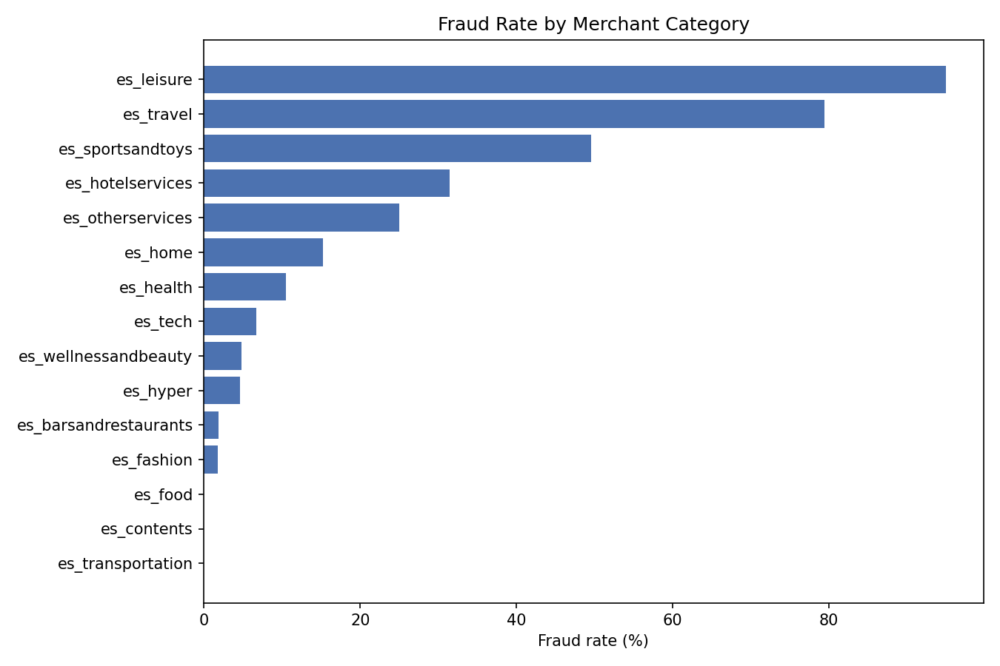
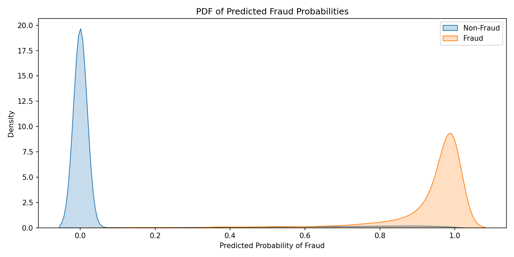

# Payment Transaction Fraud Detection (BankSim)

Predicts whether a payment transaction is fraudulent, using
probability-based reasoning (PDF analysis, `predict_proba`, data-driven
threshold tuning) rather than a bare accuracy number — with only
1.21% of transactions fraudulent, accuracy alone would be meaningless.

## Why this dataset instead of a literal UPI dataset

Public "UPI transaction" datasets on Kaggle are largely built for BI-style
questions (transaction counts, state/month breakdowns) and don't carry a
genuine fraud label. **BankSim** is a real, peer-reviewed synthetic
payment simulator (Lopez-Rojas & Axelsson, 2014) built from aggregated
real Spanish banking transaction statistics — same transaction shape as
UPI (a customer paying a merchant, categorized by type), with a real
fraud ground truth.

## Dataset

[BankSim](https://www.kaggle.com/datasets/ealaxi/banksim1) — 594,643
transactions, 7,200 fraudulent (1.21%), no missing values.

| Feature | Description |
|---|---|
| `step` | simulation time step |
| `customer` | customer ID |
| `age` | age bucket (0-6, or 'U' for unknown) |
| `gender` | M / F / E (enterprise) / U (unknown) |
| `merchant` | merchant ID |
| `category` | merchant category (transportation, food, health, leisure, etc.) — 15 categories |
| `amount` | transaction amount |
| `fraud` | target: 0 = legitimate, 1 = fraud |

**Data cleaning note:** every string field in the raw CSV is wrapped in
literal single quotes (`'C1093826151'`) — stripped before use, or every
category/age/gender group silently splits into a quoted and unquoted
duplicate. `zipcodeOri` and `zipMerchant` are constant across all
594,643 rows (the simulator modeled a single region) and were dropped
— a zero-variance feature carries no information.

## Method

Log-transform `amount` to reduce its right-skew, stratified 70/30
train/test split (critical with only 1.21% fraud — a non-stratified
split risks a skewed test set), scale after splitting (fit only on
training data to avoid leaking test-set distribution into training),
Logistic Regression with `class_weight='balanced'` to handle the class
imbalance, then a 0.01-step grid search over F1 to pick an explainable
operating threshold instead of the default 0.5.

## Results

**The standout finding: merchant category alone is an extremely
strong fraud signal** — fraud rate ranges from 95% in `es_leisure`
down to exactly 0% in `es_transportation`, `es_food`, and `es_contents`
(and `es_transportation` alone is 85% of all transactions in the
dataset).



| Metric | Default threshold (0.5) | Tuned threshold (0.95) |
|---|---|---|
| Precision (fraud) | 14.5% | **58.8%** |
| Recall (fraud) | 97.7% | 69.0% |
| F1 (fraud) | 0.252 | **0.635** |
| ROC-AUC | 0.991 | 0.991 (threshold-independent) |

At the tuned threshold: **1,490 of 2,160 fraud cases caught (69.0%)**,
1,046 false alarms, 670 missed. The default threshold catches more
fraud (97.7%) but at 14.5% precision — roughly 6 in 7 flagged
transactions would be false alarms, unworkable for a review team.
Tuning trades some recall for a precision improvement large enough to
make the flagged list actually actionable.



The model separates the two classes cleanly (ROC-AUC 0.991) — largely
because merchant category is such a direct, interpretable fraud
signal here.


## Why logistic regression, not just a category rule

Three categories alone (leisure, travel, sports/toys) carry
disproportionate fraud risk, so it's fair to ask whether a trained
model is even necessary here. The honest answer: logistic regression
still adds real value because it combines category with amount, age,
and gender simultaneously into one continuous, tunable risk score —
rather than a single hard-coded rule, which can't be threshold-tuned
the way this model's probability output can.

## Repository contents

```
fraud_detection_payments.py     -- full pipeline: EDA, modeling, threshold tuning, business impact
data/bs140513_032310.csv        -- NOT included, see Dataset section for source
fraud_predictions.csv           -- test-set predictions with fraud probability and flag
fraud_rate_by_category.png      -- fraud rate by merchant category
pdf_transaction_amount.png      -- PDF of Amount by class
pdf_predicted_probabilities.png -- PDF of model output by class
threshold_tuning.png            -- precision/recall/F1 vs threshold
roc_curve.png                   -- ROC curve
README.md                       -- this file
```

## How to reproduce

```bash
pip install pandas numpy scikit-learn matplotlib seaborn
# download bs140513_032310.csv from Kaggle, place at data/bs140513_032310.csv
python fraud_detection_payments.py
```

## References

- Lopez-Rojas, E. A., & Axelsson, S. (2014). *BankSim: A bank payment
  simulation for fraud detection research.*
- [BankSim on Kaggle](https://www.kaggle.com/datasets/ealaxi/banksim1)
- [scikit-learn Logistic Regression](https://scikit-learn.org/stable/modules/generated/sklearn.linear_model.LogisticRegression.html)
